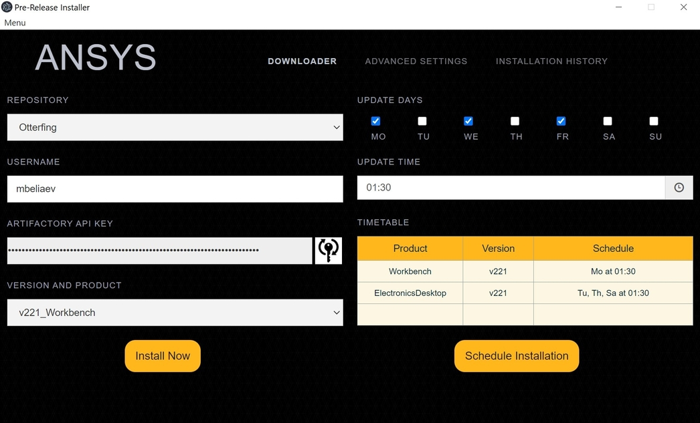
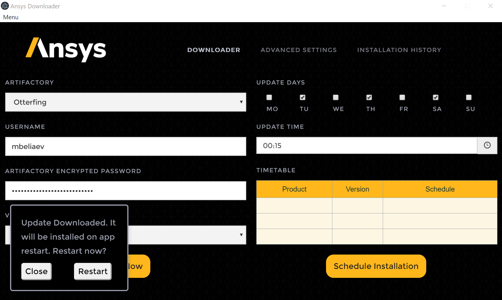

# Description 
Current project surves to help in automation of Ansys Internal build download and installation processes.
This software is going to replace manual operations required by engineers to download and install Beta Version of 
Ansys Electronics Desktop, Ansys Workbench and Ansys License Manager. 

Two modes are possible: 
1. half automatic: user installs build by clicking Install Now button
2. fully automated: scheduled autoupdate at specific days and time without any user interaction

User can install builds either from one of available Ansys Artifactories (requires VPN or Ansys Network) or 
from Ansys Sharepoint (no VPN)

# Ansys Build Downloader Installation
You can download latest version of Ansys Beta Build Installer from 
[GitHub](https://github.com/beliaev-maksim/beta_build_downloader/releases).
If you have any version of Ansys Build Downloader already installed it will be [autoupdated](#tool-autoupdate) on next 
launch.

# How to use
Almost every menu item is supplied with Tooltips to help with navigation.

There are two options as source for beta build that you can select under Repository menu:
1. SharePoint (default): no VPN connection required
2. Ansys Artifactory (recommended for Workstations and in office machines)

To download from Artifactory you have to be on VPN and get API key. 
Click on Key button and provide your Ansys SSO password to request Artifactory API key

Once you decide with repository source, you can install software on demand by clicking _"Install Now"_ button or 
schedule installation on weekly basis by clicking _Schedule Installation_. Tool is running non-graphically. 
Once you click _Install Now_ or _Schedule Installation_ you can close the window.

If you want, you can set advanced settings:
1. Installation, Download path
2. HPC or Registry options files for Electronics Desktop
3. Select only specific products from Workbench to be installed
4. Decide to keep or delete installation package after installation

User can always monitor download and installation progress on _Installation History_ panel_.
If you want to abort the process you can do it from the same page just by clicking on the row with running process.

# FAQ and features
1. if you run Ansys software (the same BETA version eg 2022R1), then download and installation would be skipped. 
This is done to prevent corruption of the build since during software run some files might be locked and thus can 
cause damaged package. 
2. Software will be downloaded and installed only if newer version exists in selected repository
3. You cannot download partial installation package of Workbench, but this should not influence much since you can 
schedule installation outside of your working hours
4. Right now tool supports only Windows OS and should be run as elevated user (admin)

 
## Tool autoupdate
 App will be autoupdated on the start of the UI

# Contribution
If you would like to contribute to the current project please do it in a way you can:
1. Submit your code changes, see [CONTRIBUTE.md](docs/CONTRIBUTE.md)
2. Open an issue (defect) on GitHub issues
3. Open user story (feature suggestion) on GitHub issues

You can always write your suggestion directly to: [Maksim Beliaev](mailto:maksim.beliaev@ansys.com)
